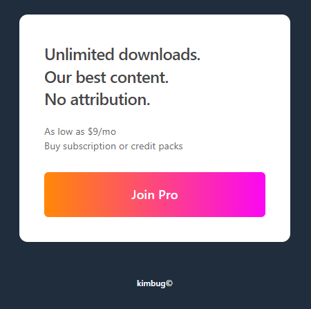

## 01 - Ad Banner

## 02 - Google Search Result Item

## 03 - Feature Box

## 04 - Logo in Header

## 05 - Breadcrumb & Pagination

## 06 - Product Card

- 별 아이콘처럼 큰 의미가 없는 부분에는 `aria-hidden="true"`
- 눈에 보이는 것과 실제 의미가 다를 때는 `aria-label` 작성

## 07 - Instagram User Profile

- CSS로 대소문자 처리, 순서 처리도 할 수 있으므로 HTML에서는 의미 전달에 집중할 것
- 스크린 리더로 사용하는 유저를 고려할 것
- key-value 쌍은 `<dl>` 태그 사용(definition list)

## 08 - Receipt

- 바코드와 같이 중요한 이미지일 경우 `strong` 태그 안에서 `img` 태그를 사용할 수도 있음
- 'L'은 스크린 리더로 읽었을 경우 의미 파악이 어려움. 따라서 `span` 태그 안에 넣어서 aria-label 작성해주면 좋음

## 09 - Github Dropdown Menu

- 아무 설정을 하지 않으면 hyphen 이후에 단어가 잘리고 다음 줄로 넘어간다. 해결 방법은 escape code로 non breaking hyphen을 사용하는 것이었다. escape code를 필요할 때 쓸 줄 아는 것도 중요하겠다는 생각이 들었다.

## 10 - Input Group

