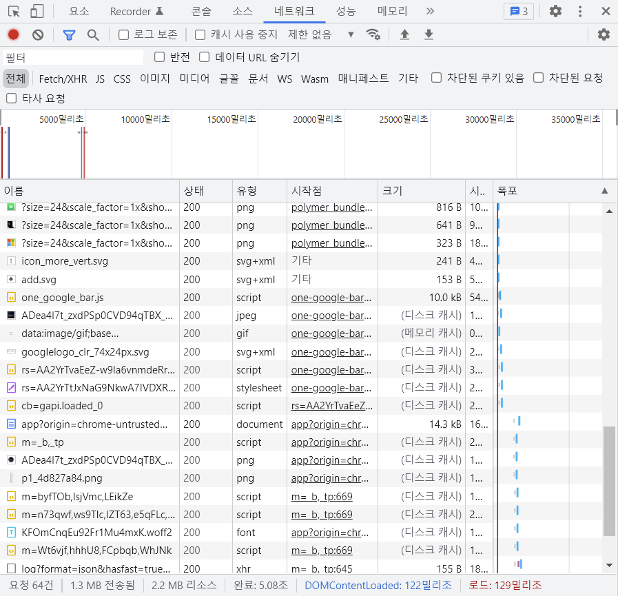

[toc]

# HTML은 재밌다 강의 정리

## 1.

### HTML이 왜 중요한가요?

- URL을 입력하면

- -> 해당 페이지를 보기 위해 필요한 리소스를 요청하고

- -> 서버가 리소스를 보내줌(HTML, CSS, JS 등등)

  

- 그래서 FE에서 HTML, CSS, JS를 공부하는 것

- 웹 페이지에 보이는 모든 것들은 **기승전 HTML 태그의 결과물**. 그래서 HTML부터 탄탄히 쌓아가야 함!
- **문서의 구조**와 **정보의 위계**가 명확하게 보이는 HTML 코드를 작성하자! (Semantic Markup)
- Semantic하게 작성하면 검색 엔진 최적화(SEO)에도 도움이 됨

### HTML을 시맨틱하게 작성해야 하는 이유

- `<div>` 쳐발쳐발 하지 말자.. 다채로운 태그를 쓰면 나에게도 동료에게도 유익함

- 시맨틱하지 않다면...

  ```html
  <p>제목입니다</p>
  <p>
      <p>리스트 요소1</p>
      <p>리스트 요소2</p>
      <p>리스트 요소3</p>
  </p>
  ```


### 제목과 문단 Headings and Paragraph

- 제목에 해당하는 부분에는 Heading Tag(`<h1>`, `<h2>` 등)
- 문단에 대해서는 `<p>` -> paragrahph

### 강조 Emphasis

- 강조하고자 하는 부분에서 사용. p 태그 내부에서도 가능. 둘 중에 끌리는 걸로 쓰면 됨.
- 글씨가 두껍다 두껍지 않다보다도 브라우저한테 이 부분이 중요하다고 알려줬다는 게 중요

- `<em></em>`: italic
- `<strong></strong>`: bold

+) `<br />`: break 태그

### 링크 Anchor

- 필수 어트리뷰트 href: hypertext reference(문서 주소값)

- href 주소값 표기 방법

  1. 웹 URL(절대/상대)

     ```html
     <a href="https://www.google.com/">Google</a>
     <a href="./index.html">Google</a>
     ```

  2. 페이지 내 이동

     - 이동하고자 하는 곳의 id값을 적어주면 됨

     ```html
     <a href="#hello">To Hello</a>
     ```

  3. 메일 쓰기

     ```html
     <a href="mailto:메일주소"></a>
     ```

     

  4. 전화 걸기

     ```html
     <a href="tel:전화번호"></a>
     ```

- 또다른 어트리뷰트: target

  - 새로운 탭에서 열렸으면 좋겠을 때

  ```html
  <a target="_blank">새 탭에서 열기</a>
  ```

  